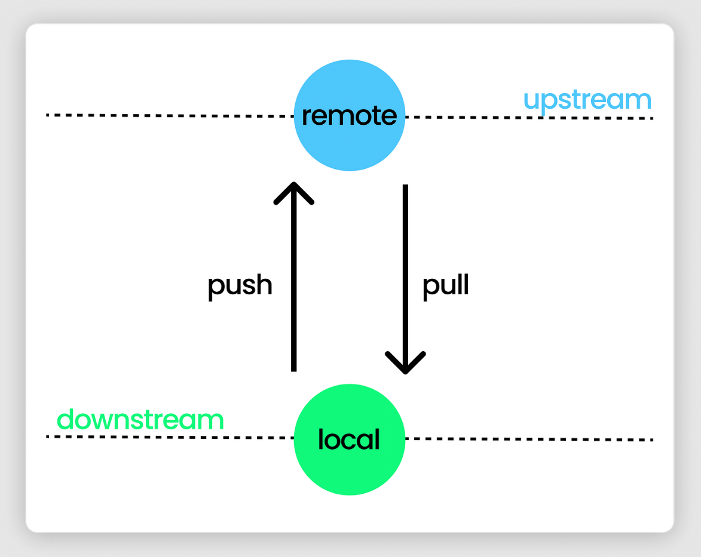

# GitHub

GitHub is a cloud-based platform where you can store and collaborate on your Git repositories. When working with GitHub, you need to understand the relationship between your local machine and the remote repository.

---

## Upstream and Downstream

### Upstream (Remote Repository)

```
Upstream = GitHub (Remote Server)
```

The **upstream** is your remote repository hosted on GitHub. It's the central location where your code is stored online and shared with other developers.

---

### Downstream (Local Repository)

```
Downstream = Your Computer (Local Machine)
```

The **downstream** is your local repository on your computer. It's where you work, make changes, and commit your code before sending it to GitHub.

---

## Workflow: Local ↔ GitHub

```
Your Computer (Downstream) ←→ GitHub (Upstream)
   Local Repo                  Remote Repo
   (git push)                  (git pull)
```

---

## Creating Files on GitHub

You can create files directly on GitHub's website without using Git commands on your computer.

---

## git push

```git
git push
```

Uploads your local commits from your computer (downstream) to GitHub (upstream).

---

## git pull

```git
git pull
```

Downloads changes from GitHub (upstream) to your computer (downstream) and merges them with your local code.m (Remote Repository)



## VSCode with GitHub

VSCode (Visual Studio Code) is a code editor that integrates seamlessly with GitHub, making it easy to manage your repositories directly from the editor.

---

## VSCode with GitHub

Throughout this course, I learned how to connect VSCode with GitHub and use its integrated features to manage my repositories more efficiently.

---

## How to Link VSCode with GitHub

I learned how to link VSCode to my GitHub account, which allows me to:
- Clone repositories directly from GitHub into VSCode
- Push and pull changes without using terminal commands
- View my GitHub repositories in the editor
- Authenticate with my GitHub credentials

---

## GitHub UI in VSCode

I learned about the built-in GitHub interface in VSCode, which includes:
- **Source Control Panel**: View changes, stage files, and commit from the UI
- **GitHub Pull Requests Extension**: Create and manage pull requests
- **Repository Explorer**: Browse files and folders from my repository
- **Integrated Terminal**: Run Git commands directly in VSCode

---

## Using GitHub Integration in VSCode

I learned how to use VSCode's GitHub integration to:
- Authenticate my GitHub account in the editor
- Clone repositories to my local machine
- Make changes to files visually
- Stage and commit changes through the UI
- Push changes to GitHub
- Create pull requests
- Manage branches visually without terminal commands
