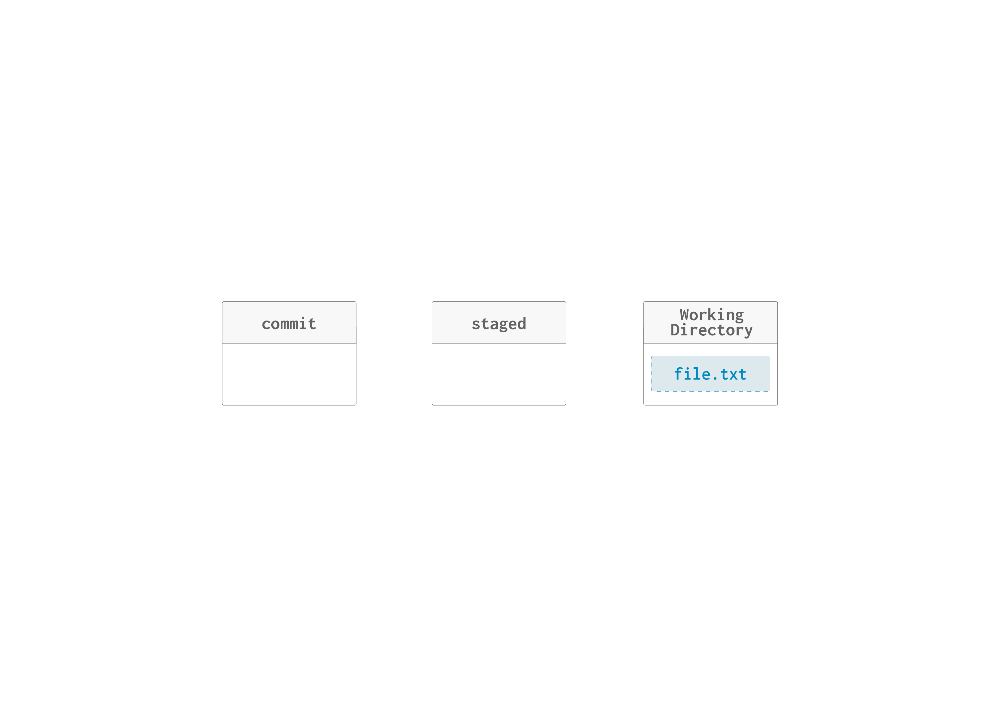
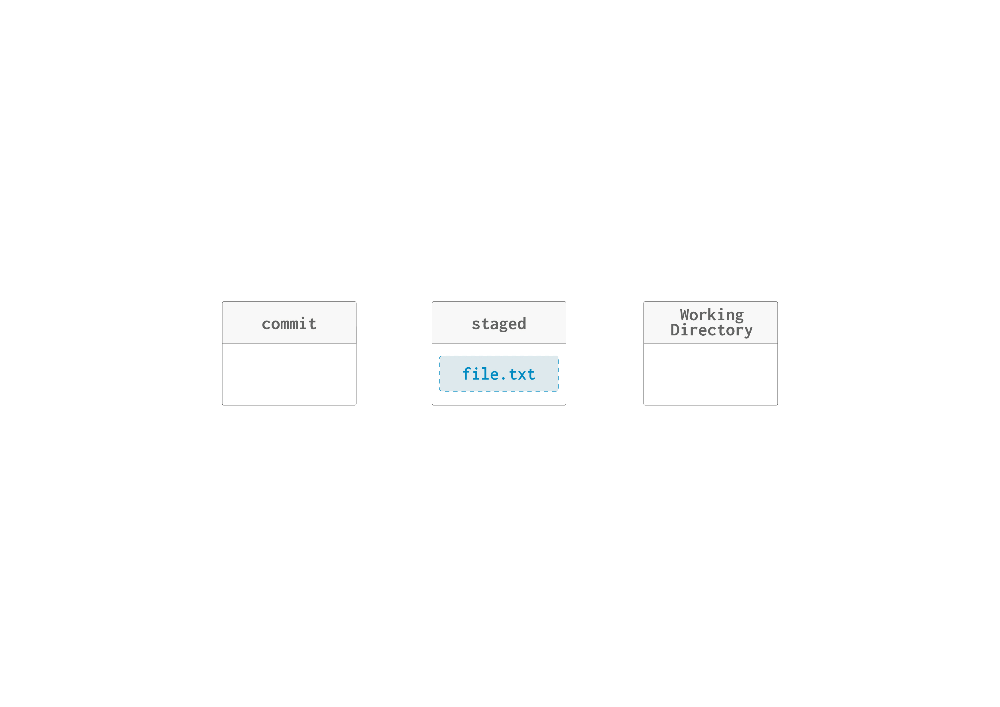
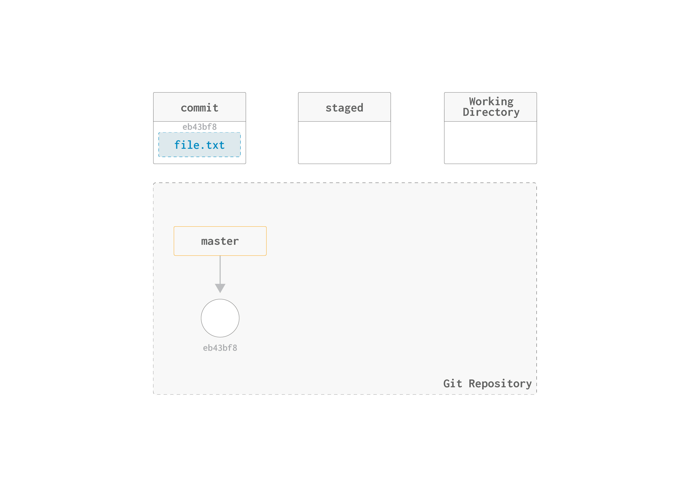
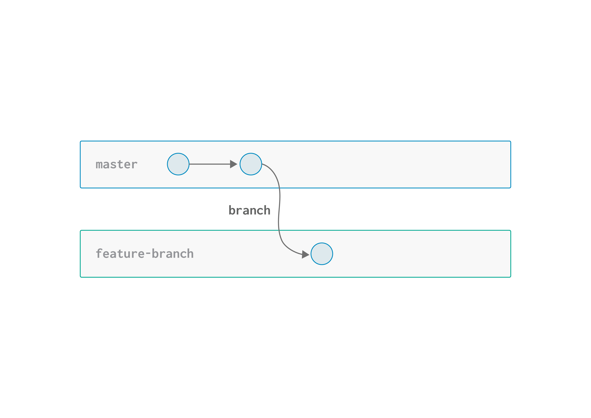
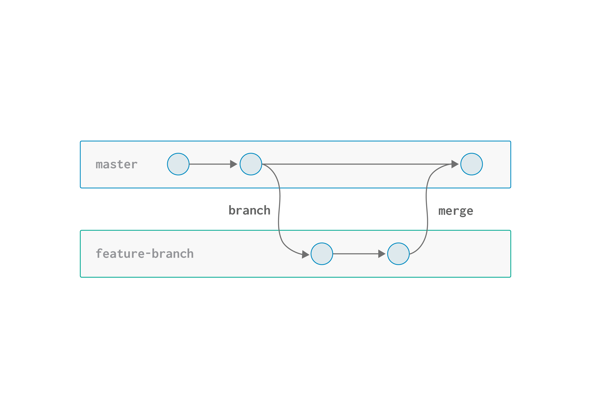

# :books:Git & GitHub Course – Tuwaiq Academy


This repository was created as part of my training in the Git and GitHub course at Tuwaiq Academy. It documents the key concepts, commands, and workflows I learned during the course.

The goal of this repository is to serve as a simple and practical reference for version control using Git, including working with repositories, commits, branches, and collaboration using GitHub.

It covers :
- Git fundamentals and concepts  
- The three-stage workflow (Working Directory, Staging Area, Repository)  
- Essential Git commands  
- Branching and basic collaboration  

This project reflects my learning journey and can be used as a quick guide for beginners who are starting with Git and GitHub.
### What is Git?

Git is a **distributed version control system** that allows developers to track changes in their code over time. Unlike centralized version control systems, Git enables every developer to have a complete copy of the project history on their local machine. This makes Git powerful for collaboration, branching, and maintaining a complete audit trail of all changes made to a project.

### Git vs GitHub
- Git is an application you install and run locally.
- Git is a local application for version control.
- You can use Git without GitHub.
- GitHub is just one of many hosting options.

## Git Areas Overview

I've learned that Git has three main areas, and each one serves a specific purpose in the version control workflow

The Three Areas:
- **``Working Directory``** - Where you create and edit your files locally
- **``Staged Area``** - Where you prepare changes before committing them
- **``Commit (Repository)``** - Where your changes are permanently saved in project h

## :computer: 1 Working Directory

**What it is:** The folder on your computer where you actually work and edit files.

**In this diagram:** Shows `file.txt` (highlighted in blue with a dashed border), indicating it's a file that exists in your local workspace but hasn't been tracked by Git yet.

**Purpose:** This is where you create, modify, and delete files before telling Git about the changes.



## :rocket: 2 Staged Area (Index)

**What it is:** A temporary holding area that prepares your changes for the next commit.

**In this diagram:** The middle section is empty, but when you run `git add file.txt`, the file moves here.

**Purpose:** Allows you to selectively choose which changes to include in your next commit. You can have multiple changes in your working directory but only stage some of them.



## :gear: 3 Commit (Repository)

**What it is:** The permanent history of your project stored in the `.git` folder.

**In this diagram:** The leftmost section is empty, but when you run `git commit -m "message"`, staged changes move here and become part of the official history.

**Purpose:** Creates a snapshot of your project at a specific point in time with a descriptive message.


# Git Commands

Throughout this Git and GitHub course, I have learned a lot of important commands that are essential for version control and collaboration. These commands form the foundation of working with Git efficiently.

### Git init
```Git
git init
```
The `git init` command is the **first command** you use when starting a new Git project. It initializes a new Git repository in your current directory.

### What does it do?

- Creates a new `.git` directory in your project folder
- Sets up all the necessary files and metadata for Git to track your project
- Prepares your project for version control
- Initializes your local repository

### Git status

```git
git status
```
Shows the current state of your working directory and staging area, displaying which files have changes.

## Git add

```git
git add filename
```
Moves changes from your working directory to the staging area, preparing them for commit.

## Git commit

```git
git commit -m "message"
```

Saves your staged changes to the Git repository with a descriptive message about what changed.

## Git log

```git
git log
```

Displays the commit history of your repository, showing all previous commits with messages and timestamps.

## Git log --oneline 
```git
git log --oneline
```
Displays the commit history in a compact, single-line format showing commit hash and message.

## Git log --oneline --graph
```git
git log --oneline --graph
```
Displays the commit history in a compact format with a visual graph showing the branch structure and merge history

## commands showing details

## Git diff

```git
git diff
```
Shows the differences between your working directory and the staging area, displaying what has changed in your files.

## Git show

```git
git show 
```
Displays the details of a specific commit, including the changes made, author, and timestamp

# Commands for Managing Branches

# Git branch

```git
git branch <name>
```
Creates a new branch with the specified name in your repository.

Example :

Create a Branch
```bash
git branch feature-branch
```



Creat a branch named Feature-branch

## Git checkout

```git
git checkout <branch-name>
```
Switches to a different branch, moving your working directory to that branch's code.

 >[!NOTE] 
 >The `HEAD` always refers to "where-you-at" currently, so when you use the `git checkout` command, you change the position of the `HEAD` from pointing to the `master` to pointing to the new branch, e.g, `feature-branch` for example. Which means any commit is currently made will be created on the `feature-branch`.


```bash
git checkout -b Newbranch-name
```
Create and switch to a new Branch and immediately switch to it.

## Git branch -d

```git
git branch -d <name>
```
Deletes a branch with the specified name from your repository.

## Merge Branches 

Git merge

```git
 git merge <branch name>
````
Combines changes from one branch into another.

Example :

```bash
 git merge feature-branch
```


Merge a branch into the current Branch.   

# 🔀 Merge Types in Git
When working with branches, Git provides different ways to combine changes. The two most common types are:

## 🚀 Fast-Forward Merge

A `fast-forward` merge happens when the target branch has not changed since the new branch was created.

### What happens?
- Git simply moves the pointer forward
- No new commit is created
- History remains linear (straight line)

## :rocket:Example of Fast-Forward Merge

```text
Before

main:    A --- B
               \
                C --- D

Feature 

After (fast-forward):

main:    A --- B --- C --- D
```
>[!TIP]
>Fast-forward merges keep your history clean and simple.

🔀 3-Way Merge (Non Fast-Forward)

A `3-way merge` happens when both branches have new commits.

What happens?
Git creates a new merge commit
Combines changes from both branches
Uses a common ancestor to merge
## 🔀 Example of 3 Ways to Merge in Git
```text
Before

main:    A --- B --- E
               \
                C --- D

feature

After (3-way merge)
main:    A --- B --- E ------- M
               \             /
                C --- D ----
```
 Why is it called `3-way`?

Git uses:

The last common commit (ancestor)
The main branch
The feature branch

>[!NOTE]
>A merge commit (M) is created to combine both histories. 

# :globe_with_meridians: Educational Resources
- [Git & GitHub Guide – SAFCSP Team](https://github.com/SAFCSP-Team/git-github.git)
- [Git Cheat Sheet](https://git-scm.com/cheat-sheet)
- [GitHub Learning Lab](https://learn.github.com/)
- [Working with GitHub in VS Code](https://code.visualstudio.com/docs/sourcecontrol/github)
